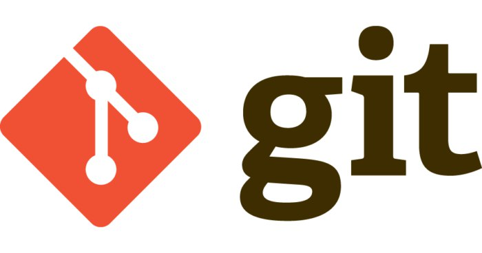
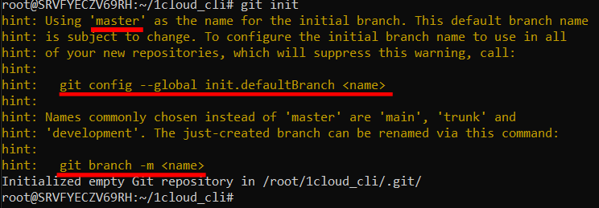
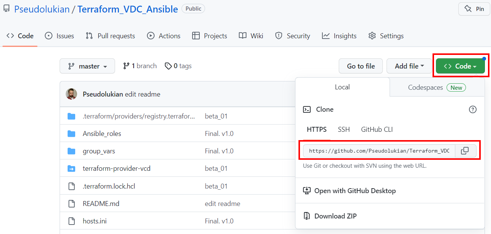

# Что такое Git?


Git — это распределенная система управления версиями, которая устанавливается на машину, где будет вестись работа над проектом.  Вот основные функции и возможности git:

1. Управление различными версиями проекта;
Создание и управление разными ветвями развития проекта;
2. Откат к предыдущим версиям проекта;
3. Быстрое клонирование проектов с удаленных git-серверов.


## Установка и обновление git
Git можно установить на все популярные десктопные ОС: Windows, Linux, MacOS. 


## Настройка git
В git есть множество сущностей, одна из которых — это коммит. Коммит сохраняет разность между предыдущим сохранением и новым сохранением. При сохранении коммита записываются мета-данные — информация о том, кто сделал коммит: имя автора и электронная почта. Эти данные очень важны в командной работе, они позволяют точно идентифицировать того, кто сделал коммит.

Настройка имени и электронной почты участника команды производится локально через консоль командами:
```
git config --global user.name [имя пользователя];
git config --global user.email [электронная почта пользователя].
```
Если имя пользователя задается с пробелом (Имя Фамилия) — тогда его необходимо указывать в двойных кавычках, электронная почта всегда задается без кавычек. При вводе электронной почты и имени пользователя git не возвращает никакого ответа, чтобы убедиться в правильности введенных данных можно выполнить команду: git config --list.


Помимо настройки имени пользователя и электронной почты в конфигурационном файле git можно указать множество других настроек, таких как: шаблон коммита, текстовый редактор коммита, настройка ветки по умолчанию и многое другое. 


## Инициализация репозитория

Инициализация или создание репозитория производится командой git init в директории проекта, при этом директория как может содержать файлы проекта, так и может быть пустой. При вызове команды git init вы увидите следующее сообщение:




Тут следует обратить внимание на несколько важных вещей:

1. По умолчанию git создаёт ветку master, где будут размещаться коммиты. В gitHUB же дефолтная ветка называется main — несоответствие веток может привести к проблемам в будущем, лучше сразу переименовать ветку master в main;
2. Задать имя дефолтной ветки можно с помощью команды git config --global init.defaultBranch main, где main — название ветки. Эта команда работает до создания первого коммита;
3. Переименовать уже существующую ветку можно командой git branch -m [название ветки].
При инициализации репозитория в директории проекта будет создана скрытая поддиректория .git, которая содержит различные сущности git и информацию о репозитории.

# Работа с gitHUB


Для работы с gitHUB — вам нужно зарегистрироваться. Это бесплатно, а функций доступных на бесплатном тарифе будет достаточно для комфортной работы. 

## Что такое gitHUB?

GitHUB — это удаленный хостинг репозиториев git. То есть это коммерческий сервис для размещения git-репозиториев и управления ими, своего рода Dropbox для хранения картинок или Google Диск для хранения файлов.

Для небольших команд gitHUB бесплатный и его функций хватит для разработки небольших публичных проектов, однако, если вы хотите разрабатывать серьезные коммерческие продукты в большой команде и вам нужна приватность — придется раскошелиться.

GitHUB обладает множеством полезных функций, которые сильно облегчают разработку и продакшн проектов:

* Система безопасной авторизации по токенам;
* Инструменты тестирования и анализа кода;
* Сервисы деплоя проектов — gitHUB actions.

### Скачивание удаленного репозитория ###


Репозитории, размещенные на gitHUB могут быть публичными — открытыми для скачивания всем желающим и приватными — доступными для скачивания только авторизованным пользователям, которым администратор репозитория выдал права. Для того, чтобы скачать репозиторий на локальную машину — нужно определить директорию, куда будет скачан проект и выполнить команду git clone [url], где url — это ссылка на удаленный репозиторий.

Найти ссылку на репозиторий можно во вкладке Code:



Просто скопируйте путь, воспользовавшись кнопкой быстрого копирования в виде двух квадратов и вставьте ссылку в терминал.


Скачанный репозиторий будет иметь не только файлы проекта, но и директорию .git, где будут храниться все git-объекты, а значит вы можете также перемещаться по веткам и коммитам скачанного репозитория. 

При скачивании удаленного репозитория git автоматически устанавливает связь между скачанным репозиторием и его удаленной версией поэтому обновлять локальный репозиторий теперь можно командой git pull, находясь в main ветке. 


## Создание удаленного репозитория и загрузка в него кода проекта ##


Войдите на gitHUB и через иконку своего аккаунта перейдите в раздел «репозитории», там через кнопку «New» создайте новый репозиторий.


На следующем шаге необходимо задать имя репозиторию, указать его тип (публичный или приватный) и задать описание репозиторию.


После успешного создания репозитория, вы увидите приветственную страницу с краткими, но очень полезными инструкциями. В них описано как синхронизировать удаленный и локальный репозитории. Давайте это и сделаем.

Связываем локальный и удаленный репозитории командой git remote add origin <url-адрес репозитория>. 

Переименовываем основную ветку в main — git branch -M main;


Выполняем команду загрузки локальных изменений в удаленный репозиторий с помощью команды git push -u origin main.

 Для загрузки изменений можно просто использовать команду git push


Скачать файлы с удаленного репозитория в локальный, если он общий — можно командой git pull (в этом случае еще будет автоматически произведено слияние(merge)). 

## Основные команды Git
Введение в контроль версий. Работа с Git. Составление инструкции по работе с Git.
* git init – инициализация локального репозитория
* git status – получить информацию от git о его текущем состоянии
* git add – добавить файл или файлы к следующему коммиту
* git commit -m “message” – создание коммита.
* git log – вывод на экран истории всех коммитов с их хеш-кодами
* git branch – посмотреть список веток в репозитории
* git branch <название ветки> – создать новую ветку
* git checkout <название ветки> – переход к другой ветке
* git branch -d <название ветки> – удалить ветку
* git log --graph - визуализирует коммиты
* git checkout -b <название ветки> -> Создание и переход в новую ветку
* git commit --amend -m “text” - изменение текста последнего коммита

* git clone <url-адрес репозитория> – клонирование внешнего репозитория на
локальный ПК
* git pull – получение изменений и слияние с локальной версией
* git push – отправляет локальную версию репозитория на внешний
* git remote add origin  <url-адрес репозитория> — команда, которой устанавливается подключение к удаленному серверу и git репозиторию на нем.
